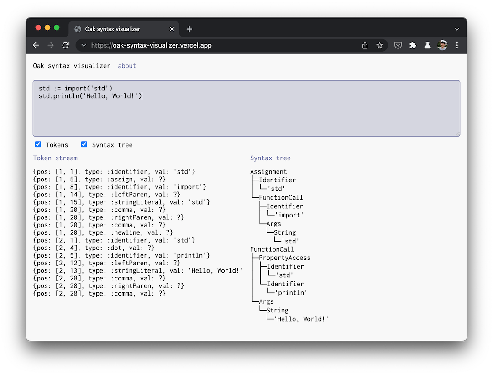

# Oak syntax visualizer 🔭

An interactive visualizer for tokens and syntax trees of Oak programs, made for my GopherCon 2021 talk on building a toy programming language and the [Oak programming language](https://oaklang.org). OSV can run as both a command-line app and a web application. You can try the web app at [oak-syntax-visualizer.vercel.app](https://oak-syntax-visualizer.vercel.app/).



## How it works

OSV takes the source text of an Oak program, and renders either a string-formatted list of tokens from the program, or a Unicode-formatted visualization of the syntax tree of the program. Both of these features are built on the [Oak standard library support for parsing Oak syntax](https://github.com/thesephist/oak/blob/main/lib/syntax.oak), and are exposed to the CLI and the web app through a common library called `pprint`, at `./lib/pprint`.

### The `pprint` library

Oak has _standard library support_ for tokenizing, parsing, and auto-formatting. The `pprint` library builds on this library to provide two additional APIs:

`pprint.tokenStream(text)` tokenizes the program text and returns a string representation of the token stream (a list of object literals). Its output looks like

```
{pos: [1, 1], type: :identifier, val: 'std'}
{pos: [1, 4], type: :dot, val: ?}
{pos: [1, 5], type: :identifier, val: 'println'}
{pos: [1, 12], type: :leftParen, val: ?}
{pos: [1, 13], type: :stringLiteral, val: 'Hello, World!'}
{pos: [1, 28], type: :comma, val: ?}
{pos: [1, 28], type: :rightParen, val: ?}
{pos: [1, 28], type: :comma, val: ?}
```

`pprint.syntaxTree(text)` fully parses the program text and returns a text representation of the syntax tree drawn with Unicode [box drawing characters](https://en.wikipedia.org/wiki/Box-drawing_character). It's meant to be displayed in a monospace text block, such as a terminal output or a `<code>` block on the web. On syntax errors found during parsing, the function will instead return a string representation of the syntax error.

Its output looks like

```
FunctionCall
├─PropertyAccess
│ ├─Identifier
│ │ └─'std'
│ └─Identifier
│   └─'println'
└─Args
  └─String
    └─'Hello, World!'
```

Internally, this rendering is accomplished by first transforming the syntax tree from `syntax.parse()` into a tree of lists, like

```rb
[:FunctionCall
	[:PropertyAccess
		[:Identifier 'std']
		[:Identifier 'println']]
	[:Args
		[:String 'Hello, World!']]]
```

and then rendering this output to a string using a custom algorithm in `pprint.renderTreeDown`.

## The CLI

The OSV CLI is a light wrapper around the `pprint` library. Depending on the command-line switch (`-tokens` or `-ast`), it exposes a REPL to standard input that feeds directly into either `pprint.tokenStream` or `pprint.syntaxTree`.

To run it, execute `./cli.oak` with the [Oak CLI](https://github.com/thesephist/oak) installed.

## The web app

The web app goes one step further than the CLI, and gives you an interactive interface to see both the token stream and the syntax tree for a program visualized as you type. The web app itself is implemented in a single short `public/app.js.oak` file, and watches for changes to the text input to update the page with visualizations on every keystroke.

## Development

Both the single-page app and the CLI for OSV are built with Oak, and require the Oak CLI to develop. The CLI is a simple Oak program. The single-page web application lives in `./public` and must be compiled to JavaScript to run.

To recompile the web app, use:

```sh
oak build --entry public/app.js.oak --output public/bundle.js --web
```

To automatically format all Oak source files, use:

```sh
oak fmt *.oak lib/*.oak public/*.oak --fix
```
